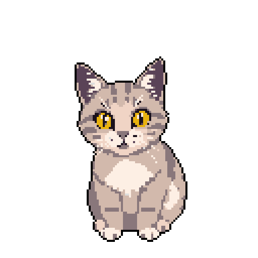

# cat vs life 

   This is a very simple game about a cat and its tutor, a young woman who's facing a difficult time entering the adult life.  This is a very simple game about a cat and its tutor, a young woman who's facing a difficult time entering the adult life. The kitty has compassion and will help her face these challenges. So the player controls the kitty while confronting enemies like the ones mentioned. The kitty can move and jump. It can also attack, using its claws or vomiting hairballs, or meowing.

